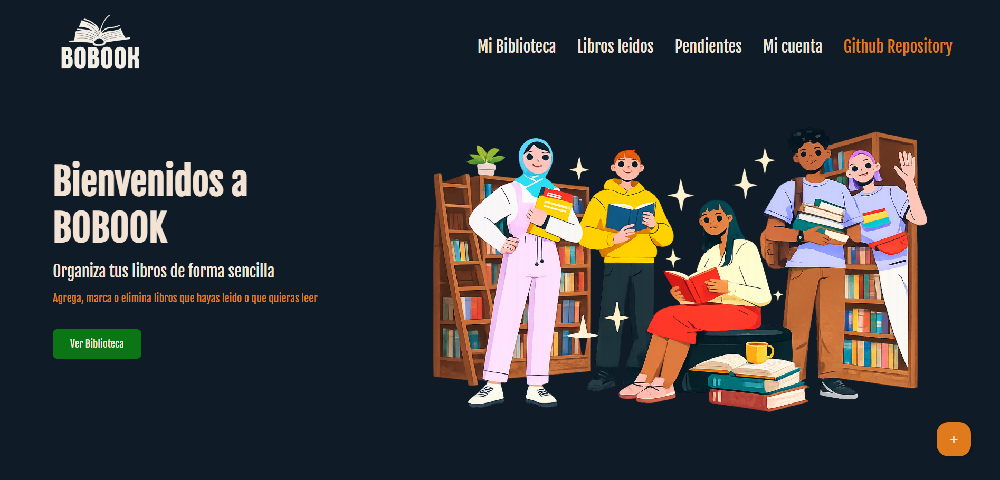
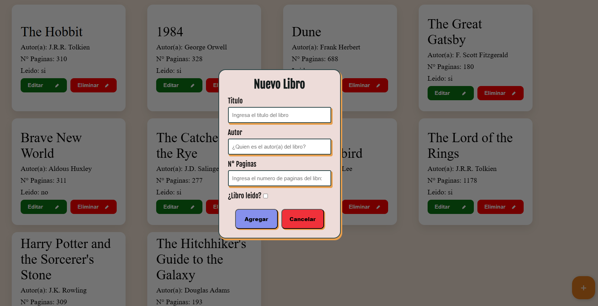

# 📚 Mi Biblioteca

Aplicación web para gestionar tu biblioteca personal. Permite agregar, editar y eliminar libros, llevando un registro de cuáles has leído.
🌐 **[Ver demo en vivo](https://ignaciocastrot.github.io/Project-Library/)**

## Funcionalidades

- Agregar libros con título, autor, número de páginas y estado de lectura
- Editar la información de cualquier libro
- Eliminar libros de la biblioteca
- Visualización en cards con diseño responsive

## Tecnologías

- HTML
- CSS
- JavaScript (Vanilla)

## Aprendizajes aplicados

- Programación orientada a objetos con clases en JS
- Manipulación del DOM
- Delegación de eventos
- CRUD sin base de datos (array en memoria)
